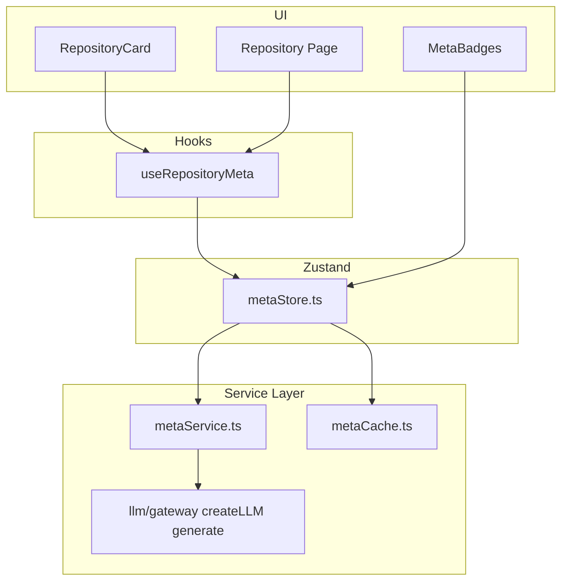

# AI Wiki 카드 — RepositoryMeta 자동 생성 계획

## 목표

GitHub 저장소 정보(`name`, `description`, `language`, `topics`)를 LLM에 전달해 [`RepositoryMeta`](src/types/repository.ts)를 생성하고, 카드·상세 페이지에 **AI Wiki 배지**로 노출합니다.

**확정 사항**
- Provider: **OpenAI `gpt-5-mini`** (기본값)
- API 호출: **클라이언트 `VITE_OPENAI_KEY`** (MVP)
- SDK 출처: [goorm-260630-multi-llm-sdk](https://github.com/junsang-dong/goorm-260630-multi-llm-sdk)의 `src/llm/` 모듈 이식

---

## 아키텍처



**생성 타이밍 (Lazy)**
- 카드가 뷰포트에 진입할 때(`IntersectionObserver`) 메타 요청
- 캐시 hit → 즉시 표시 / miss → LLM 호출 → 캐시 저장
- 동시 요청 **최대 3개** (Rate Limit·비용 제어)
- API 키 없음 → **규칙 기반 fallback** (topics/language 키워드 매칭)

---

## 1단계: Multi LLM SDK 이식

[goorm-260630-multi-llm-sdk](https://github.com/junsang-dong/goorm-260630-multi-llm-sdk)에서 아래 구조를 [`src/llm/`](src/llm/)로 복사합니다.

```
src/llm/
  index.ts
  types/index.ts
  config/index.ts
  providers/openai/adapter.ts
  gateway/registry.ts
  gateway/factory.ts
```

**의존성 추가** ([`package.json`](package.json)):

```bash
npm install openai
```

Phase 2a에서는 OpenAI만 사용하지만, SDK 전체를 이식해 이후 Claude/Gemini 확장 경로를 유지합니다.

**환경 변수** ([`.env.example`](.env.example), [`src/config/env.ts`](src/config/env.ts)):

```env
VITE_OPENAI_KEY=sk-...
VITE_LLM_PROVIDER=openai
VITE_LLM_MODEL=gpt-5-mini
```

---

## 2단계: 타입 확장

[`src/types/repository.ts`](src/types/repository.ts) — `RepositoryMeta` 확장:

```typescript
export type DifficultyLevel = 'beginner' | 'intermediate' | 'advanced'

export interface RepositoryMeta {
  difficulty: DifficultyLevel | ''
  category: string
  learningTime: string      // e.g. "2-3h"
  recommended: boolean
  summary: string           // AI 한 줄 요약 (카드용)
  generatedAt?: string
  generatedBy?: 'openai' | 'heuristic'
}
```

`DifficultyLevel`은 LLM JSON 응답용 enum, UI에서는 i18n으로 "입문/초급/중급" 표시.

---

## 3단계: 메타 서비스 계층

### [`src/services/llm/metaCache.ts`](src/services/llm/metaCache.ts)

| 항목 | 값 |
|------|-----|
| 키 | `nextwiki_meta_{repoName}` |
| TTL | 7일 |
| API | `getMetaCache`, `setMetaCache`, `isMetaExpired` |

기존 [`cache.ts`](src/services/github/cache.ts) 패턴 재사용.

### [`src/services/llm/metaService.ts`](src/services/llm/metaService.ts)

**`generateRepositoryMeta(repo: Repository, locale: Locale): Promise<RepositoryMeta>`**

1. 캐시 확인 → 있으면 반환
2. `VITE_OPENAI_KEY` 없으면 `generateHeuristicMeta(repo)` fallback
3. LLM 호출 (`createLLM` + `generate`):

```typescript
// systemPrompt: JSON만 반환하도록 지시
// userPrompt: name, description, language, topics, locale
{
  "difficulty": "beginner" | "intermediate" | "advanced",
  "category": "React",
  "learningTime": "2-3h",
  "recommended": true,
  "summary": "한 줄 학습자 친화 요약"
}
```

4. `JSON.parse` + 스키마 검증 (`difficulty` enum, `recommended` boolean)
5. 실패 시 heuristic fallback
6. 캐시 저장 후 반환

**입력 범위:** 카드용이므로 README는 **포함하지 않음** (비용·속도 최적화). description + topics만으로 충분.

### [`src/utils/heuristicMeta.ts`](src/utils/heuristicMeta.ts)

API 키 없을 때 [`filterRepos.ts`](src/utils/filterRepos.ts)의 `CATEGORY_KEYWORDS`를 재사용해 category/difficulty 추정.

---

## 4단계: Zustand 메타 스토어

### [`src/store/metaStore.ts`](src/store/metaStore.ts)

| 상태 | 타입 |
|------|------|
| `metaByRepo` | `Record<string, RepositoryMeta>` |
| `loadingRepos` | `Set<string>` (in-flight) |
| `queue` | 내부 요청 큐 (concurrency 3) |

**액션:** `fetchMeta(repoName, repo, locale)` — 중복 요청 방지, 큐 처리

---

## 5단계: Hook — Lazy 로딩

### [`src/hooks/useRepositoryMeta.ts`](src/hooks/useRepositoryMeta.ts)

```typescript
export function useRepositoryMeta(repository: Repository) {
  // IntersectionObserver로 ref 연결
  // isVisible && !meta && !loading → fetchMeta()
  return { ref, meta, loading, isAI }
}
```

[`usePreferencesStore`](src/store/preferencesStore.ts)에서 `locale` 읽어 summary 언어에 반영.

---

## 6단계: UI 컴포넌트

### [`src/components/repository/MetaBadges.tsx`](src/components/repository/MetaBadges.tsx)

메타가 있을 때만 렌더:

```
[입문] [2-3h] [React] [추천]
AI: "React hooks 연습에 좋은 Todo 프로젝트"
```

- `difficulty` → 색상 variant (입문=secondary, 중급=outline, 고급=destructive 톤)
- `recommended` → 별 아이콘 + "추천" 배지
- `summary` → `text-xs text-muted-foreground line-clamp-2`
- `loading` → Skeleton 배지 2~3개

### [`src/components/repository/RepositoryCard.tsx`](src/components/repository/RepositoryCard.tsx) 수정

- `useRepositoryMeta(repository)` 연결
- 카드 root에 `ref` 부착
- `MetaBadges`를 topics 아래에 삽입

### [`src/pages/Repository.tsx`](src/pages/Repository.tsx) 수정

- 상단 메타 영역에 `MetaBadges` 추가 (상세 진입 시 즉시 fetch — observer 없이)

---

## 7단계: i18n

[`src/i18n/translations.ts`](src/i18n/translations.ts)에 추가:

```typescript
meta: {
  beginner: '입문' / 'Beginner',
  intermediate: '중급' / 'Intermediate',
  advanced: '고급' / 'Advanced',
  recommended: '추천' / 'Recommended',
  aiLabel: 'AI' / 'AI',
  generating: 'AI 분석 중...' / 'Analyzing...',
  hours: '{{time}}' / '{{time}}',
}
```

`difficulty` enum → `t('meta.beginner')` 등으로 매핑하는 [`src/utils/metaLabels.ts`](src/utils/metaLabels.ts).

---

## 8단계: 비용·안전 장치

| 장치 | 내용 |
|------|------|
| Lazy 생성 | 뷰포트 진입 시에만 호출 |
| Concurrency 3 | 동시 LLM 요청 제한 |
| 7일 캐시 | 동일 repo 재호출 방지 |
| README 미포함 | 토큰 절약 |
| Heuristic fallback | 키 없어도 UI 동작 |
| JSON mode | `response_format: { type: 'json_object' }` (OpenAI) |

**보안 참고 (README 문서화):** `VITE_OPENAI_KEY`는 브라우저에 노출됩니다. 프로덕션에서는 Phase 2b에서 Vercel API Route 프록시로 이전 권장.

---

## 파일 변경 요약

| 작업 | 파일 |
|------|------|
| 신규 | `src/llm/**` (SDK 이식) |
| 신규 | `src/services/llm/metaService.ts`, `metaCache.ts` |
| 신규 | `src/store/metaStore.ts` |
| 신규 | `src/hooks/useRepositoryMeta.ts` |
| 신규 | `src/components/repository/MetaBadges.tsx` |
| 신규 | `src/utils/heuristicMeta.ts`, `metaLabels.ts` |
| 수정 | `src/types/repository.ts` |
| 수정 | `src/config/env.ts`, `.env.example` |
| 수정 | `src/components/repository/RepositoryCard.tsx` |
| 수정 | `src/pages/Repository.tsx` |
| 수정 | `src/i18n/translations.ts` |
| 수정 | `package.json`, [`README.md`](README.md) |

---

## 완료 기준 (Definition of Done)

- [ ] OpenAI 키 설정 시 카드 뷰포트 진입 → AI 메타 배지 표시
- [ ] 난이도·학습시간·카테고리·추천·한줄요약 5개 필드 표시
- [ ] 동일 repo 재방문 시 캐시에서 즉시 로드 (LLM 재호출 없음)
- [ ] API 키 없을 시 heuristic fallback으로 배지 표시
- [ ] ko/en locale에 맞는 난이도 라벨
- [ ] 상세 페이지에도 동일 메타 표시
- [ ] `npm run build` 성공

---

## 구현 순서

1. SDK 이식 + env + openai 설치
2. 타입·캐시·heuristic·metaService
3. metaStore + useRepositoryMeta hook
4. MetaBadges + RepositoryCard 연동
5. Repository 상세 페이지 + i18n
6. README 업데이트 + 수동 테스트
